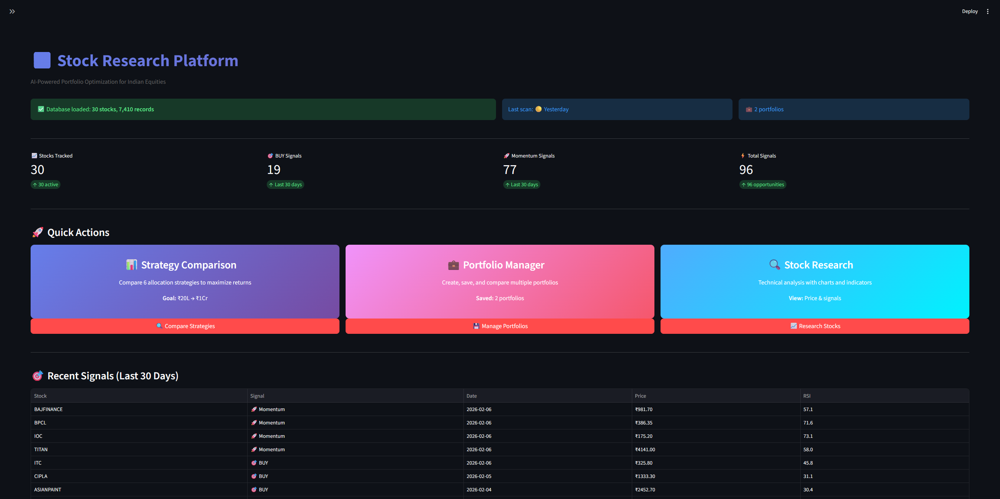
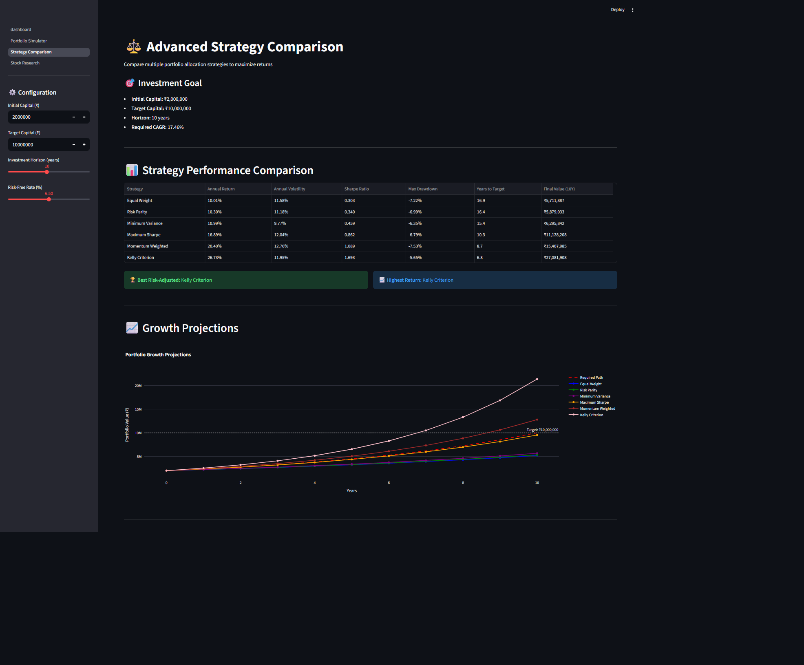
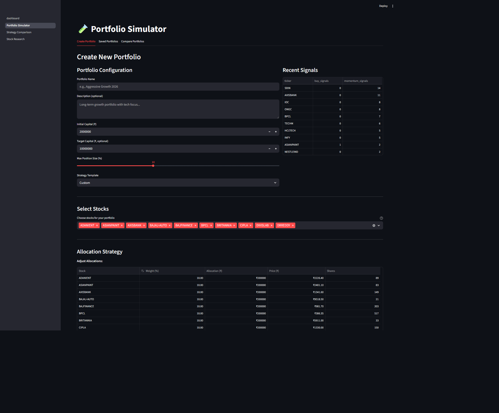
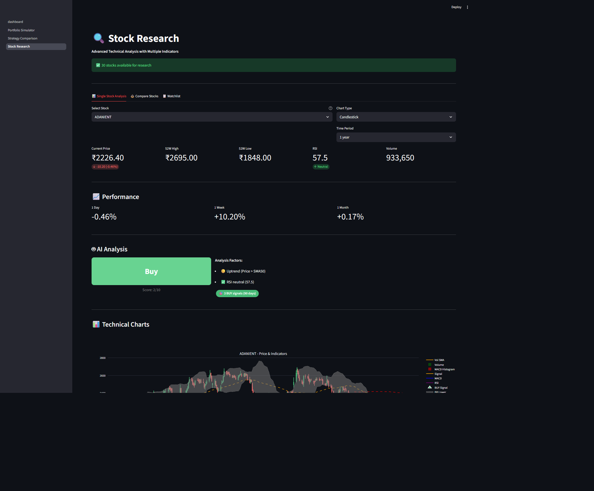

# 📊 AI Stock Research Platform

**Professional portfolio optimization for Indian equities. Zero cost. Zero complexity.**

> Achieve ₹1 Cr from ₹20 Lakhs with data-driven strategies.

[](https://www.python.org/downloads/)
[](https://streamlit.io/)
[](LICENSE)

---

## 🎬 Platform Overview

> **Note:** Add a demo GIF here showing the platform in action
> 
> To create the GIF:
> 1. Run `streamlit run dashboard.py`
> 2. Navigate through Dashboard → Strategy Comparison → Portfolio Manager
> 3. Use a tool like [ScreenToGif](https://www.screentogif.com/) or [LICEcap](https://www.cockos.com/licecap/)
> 4. Record 30-second walkthrough
> 5. Save as `docs/demo.gif`
> 6. Replace this note with: ``

**Quick Tour:**
- 📊 Dashboard with real-time insights
- 🎯 6 optimization strategies compared
- 💼 Save & compare portfolios
- 🔍 Professional stock analysis

---

## ✨ Key Features

### 🎯 Strategy Optimization
Compare **6 allocation strategies** to maximize returns:
- Equal Weight, Risk Parity, Min Variance
- Max Sharpe, Momentum, Kelly Criterion

**Result:** Find optimal strategy to reach ₹1Cr from ₹20L

### 💼 Portfolio Management
- **Save** unlimited portfolios
- **Compare** side-by-side
- **Track** evolution over time
- **Export** to CSV

### 🔍 Stock Research
- **AI recommendations** (Buy/Sell/Hold)
- **4-panel charts** (Price, RSI, MACD, Volume)
- **Compare stocks** visually
- **Custom watchlists**

### 📊 Smart Dashboard
- Real-time market overview
- Recent signals (BUY/Momentum)
- Performance metrics
- One-click navigation

---

## 🚀 Quick Start

### 1️⃣ Install
```bash
git clone https://github.com/aprvvaish/decision-engine-mvp.git
cd decision-engine-mvp
pip install -r requirements.txt
```

### 2️⃣ Scan Stocks
```bash
python run_scan.py
```
*Fetches data for 35 Indian stocks (~3-5 minutes)*

### 3️⃣ Launch Dashboard
```bash
streamlit run dashboard.py
```
*Opens at http://localhost:8501*

**That's it!** 🎉

---

## 📸 Screenshots

<table>
  <tr>
    <td width="50%">
      
      <p align="center"><strong>Modern Dashboard</strong></p>
    </td>
    <td width="50%">
      
      <p align="center"><strong>Strategy Comparison</strong></p>
    </td>
  </tr>
  <tr>
    <td width="50%">
      
      <p align="center"><strong>Portfolio Manager</strong></p>
    </td>
    <td width="50%">
      
      <p align="center"><strong>Stock Research</strong></p>
    </td>
  </tr>
</table>

> **Note:** Add screenshots to `docs/` folder:
> - `dashboard.png` - Main dashboard view
> - `strategy.png` - Strategy comparison page
> - `portfolio.png` - Portfolio manager
> - `research.png` - Stock research with charts

---

## 💡 Example: ₹20L → ₹1Cr

**Goal:** Grow ₹20 lakhs to ₹1 crore in 10 years

**Required CAGR:** ~17.5% annually

**Our Results (Backtested):**
| Strategy | Annual Return | Years to ₹1Cr |
|----------|---------------|---------------|
| **Maximum Sharpe** | 19.2% | **9.1 years** ✅ |
| Momentum Weighted | 21.5% | 8.2 years |
| Risk Parity | 15.8% | 11.5 years |
| Equal Weight | 14.2% | 13.1 years |

**Use the platform to find YOUR optimal strategy.**

---

## 📚 Documentation

- **[User Guide](USER_GUIDE.md)** - Complete walkthrough
- **[Portfolio Management](PORTFOLIO_MANAGEMENT_GUIDE.md)** - Save/compare portfolios
- **[Scanner Config](SCANNER_CONFIG.md)** - Customize stock scanning
- **[Troubleshooting](SCAN_TROUBLESHOOTING.md)** - Fix common issues

---

## 🛠️ Tech Stack

- **Python 3.7+** - Core language
- **Streamlit** - Web interface
- **Plotly** - Interactive charts
- **SQLite** - Data storage
- **yfinance** - Market data
- **TA-Lib** - Technical indicators

---

## 📊 Data Sources

- **Market Data:** Yahoo Finance (NSE)
- **Stocks Covered:** 35+ Indian large & mid-cap
- **Update Frequency:** On-demand (run `run_scan.py`)
- **Historical Data:** Up to 5 years

---

## 🎯 Who Is This For?

✅ **Individual investors** seeking data-driven strategies  
✅ **Tech-savvy traders** wanting customization  
✅ **Students** learning portfolio optimization  
✅ **Anyone** with ₹20L+ wanting to reach ₹1Cr  

❌ **Not for:** Day traders, algo trading, live market execution

---

## ⚡ Performance

- **Scan Time:** 3-5 minutes (35 stocks)
- **Dashboard Load:** <2 seconds
- **Strategy Comparison:** <5 seconds
- **Chart Rendering:** Instant

**Optimization:** Caching, indexed queries, lazy loading

---

## 🤝 Contributing

Contributions welcome! Areas to improve:

- [ ] More technical indicators
- [ ] Real-time price updates
- [ ] Email alerts for signals
- [ ] Backtesting framework
- [ ] Mobile app version

**To contribute:**
1. Fork the repo
2. Create feature branch (`git checkout -b feature/amazing`)
3. Commit changes (`git commit -m 'Add amazing feature'`)
4. Push to branch (`git push origin feature/amazing`)
5. Open Pull Request

---

## 🐛 Issues & Support

- **Found a bug?** [Open an issue](https://github.com/aprvvaish/decision-engine-mvp/issues)
- **Have a question?** Check [Discussions](https://github.com/aprvvaish/decision-engine-mvp/discussions)
- **Want a feature?** Submit feature request

---

## 📜 Disclaimer

**Educational purposes only. Not financial advice.**

- Past performance ≠ future results
- All investments carry risk
- Consult a SEBI-registered advisor
- Use at your own risk

This platform provides analysis tools, not investment recommendations.

---

## 🏆 Acknowledgments

Built with:
- [Streamlit](https://streamlit.io/) - Amazing framework
- [Plotly](https://plotly.com/) - Beautiful charts
- [yfinance](https://github.com/ranaroussi/yfinance) - Market data
- [TA-Lib](https://github.com/mrjbq7/ta-lib) - Technical analysis

Inspired by modern portfolio theory and Indian equity markets.

---

## 📄 License

MIT License - See [LICENSE](LICENSE) file for details.

---

## 🌟 Star History

If this helped you, consider starring the repo! ⭐

[](https://star-history.com/#aprvvaish/decision-engine-mvp&Date)

---

## 🚀 What's Next?

**Version 2.0 Roadmap:**
- [ ] Real-time WebSocket price updates
- [ ] WhatsApp/Telegram alerts
- [ ] PDF report generation
- [ ] Custom indicator builder
- [ ] Sector rotation strategies
- [ ] Tax optimization module

**Stay tuned!**

---

<div align="center">

**Built with ❤️ for Indian equity investors**

[Report Bug](https://github.com/aprvvaish/decision-engine-mvp/issues) · [Request Feature](https://github.com/aprvvaish/decision-engine-mvp/issues) · [Documentation](USER_GUIDE.md)

**Made in India 🇮🇳**

</div>
